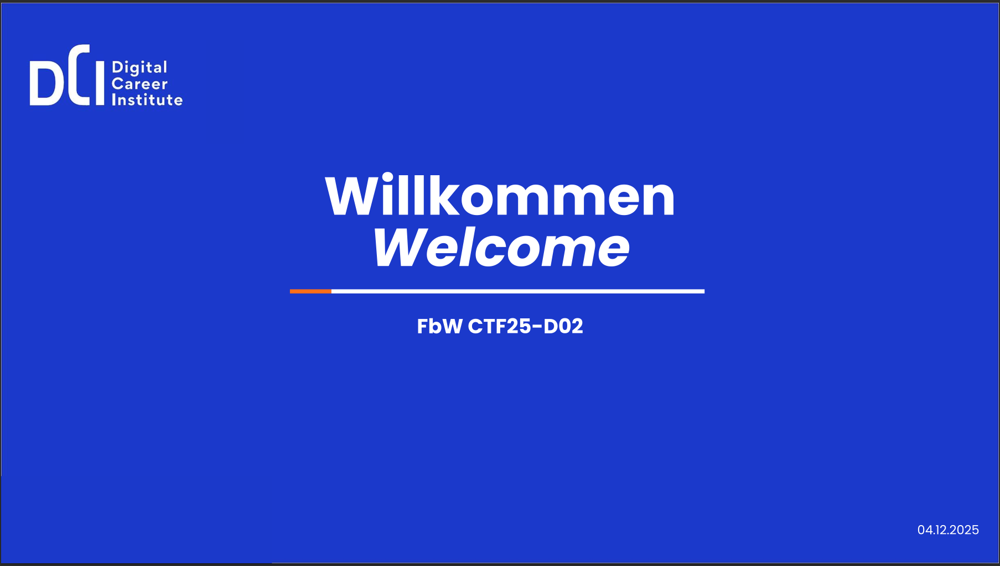
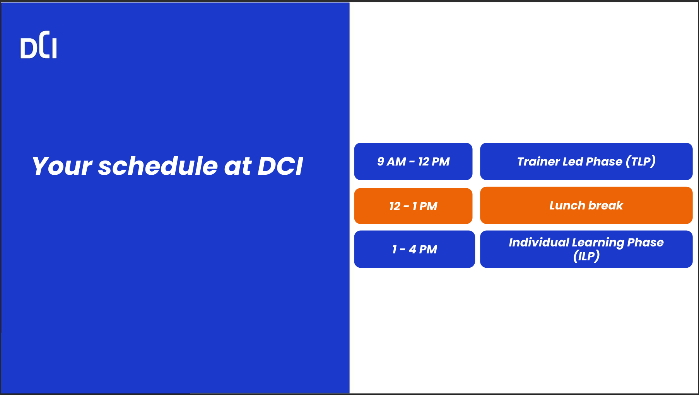
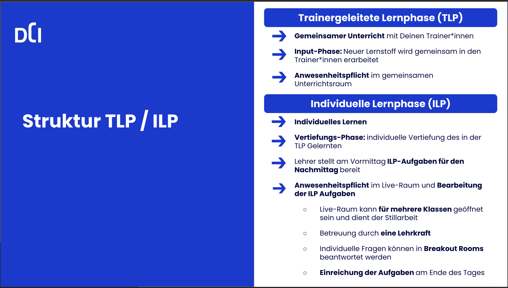
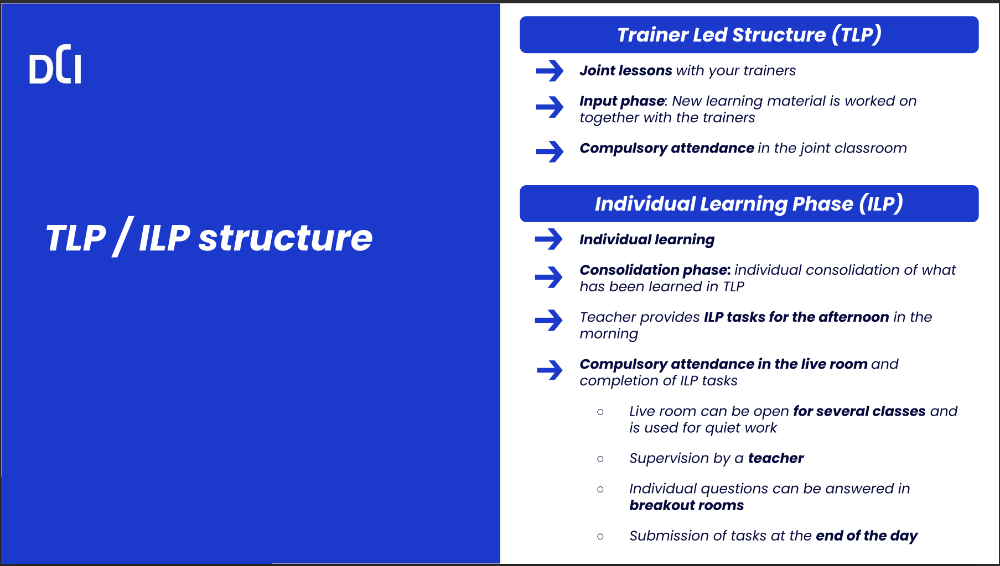
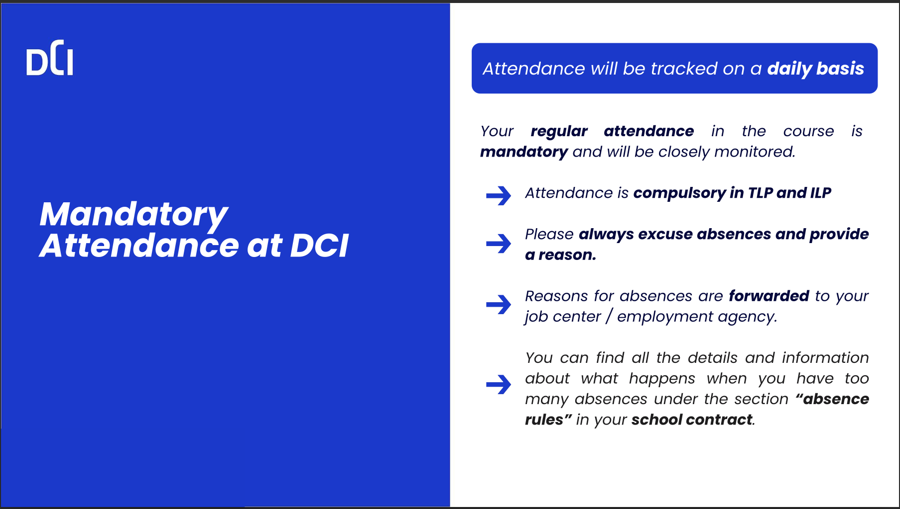
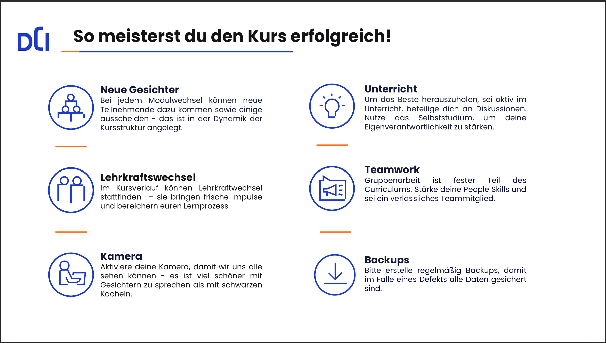
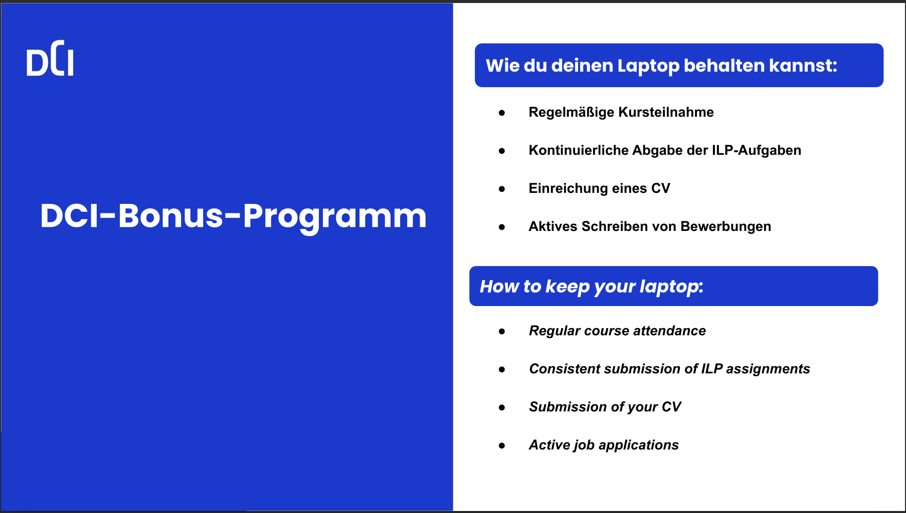
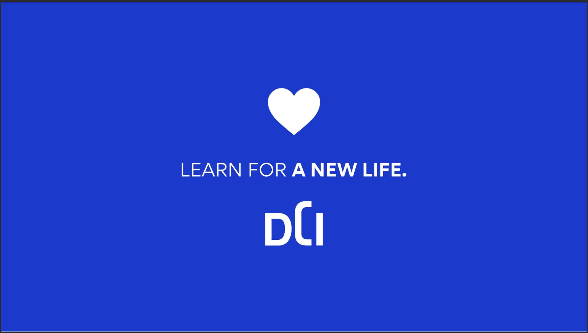

# CORE TECH FUNDAMENTALS - CTF REPO

## English Overview

- This repository contains all of our Core Tech Fundamentals (CTF) daily lecture.
- This Readme also summarizes the most important information from Class Management.

## User Guide

- Clone this repository to your local machine ONLY THE FIRST TIME you access it.
- Use `git pull` AT THE END OF EVERY LESSON DAY to update your local repository with the latest changes from the remote repository
- YOU CAN'T PUSH ANY CHANGES TO THIS REPOSITORY. It is read-only for course participants.

---

## Deutsch Übersicht

- Dieses Repository enthält alle unsere Core Tech Fundamentals (CTF) täglichen Vorlesungen.
- Dieses Readme fasst auch die wichtigsten Informationen aus dem Klassenmanagement zusammen.

## Benutzerhandbuch

- Klon dieses Repository auf dein lokales Gerät NUR DAS ERSTE MAL, wenn du darauf zugreifst.
- Verwende `git pull` AM ENDE JEDES UNTERRICHTSTAGES, um dein lokales Repository mit den neuesten Änderungen aus dem Remote-Repository zu aktualisieren.
- DU KANNST KEINE ÄNDERUNGEN AN DIESEM REPOSITORY PUSHEN. Es ist für Kursteilnehmer nur lesbar.

---

 

 

 

 

 

 

 

 

