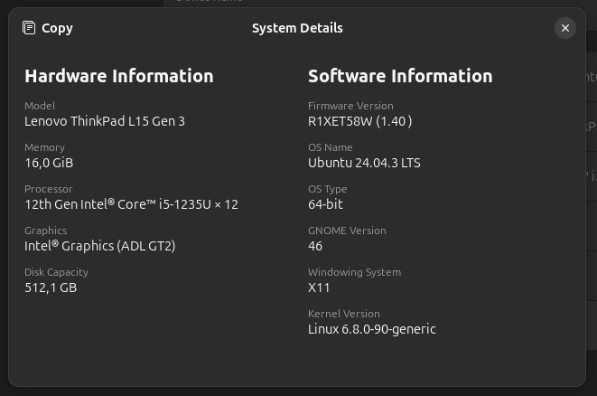
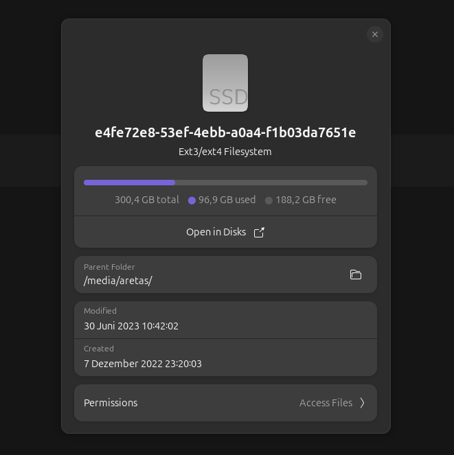

# Übung: E-Mails mit Anhängen senden

Um alles zu üben, was du über Betriebssystem- und E-Mail-Grundlagen gelernt hast, soll dir diese Übung helfen, E-Mails mit wichtigen Informationen über dein System an den Dozenten zu senden.

## 1. Systeminformationen sammeln

- Finde die zusammenfassenden Informationen deines Systems heraus, wie wir es im Abschnitt Betriebssystem-Grundlagen gelernt haben (siehe das beigefügte Beispiel-Screenshot).
  - Eine Zusammenfassung deines Betriebssystems (OS) einschließlich Version und Architektur.
  - Eine Zusammenfassung deines verfügbaren Speicherplatzes.

Beispiel-Screenshot 1

---

Beispiel-Screenshot 2

---

## 2. Eine E-Mail mit Anhängen senden

- Verfasse eine E-Mail an die E-Mail-Adresse des Dozenten (ndimofor.aretas@digitalcareerinstitute.org).
- Füge in den E-Mail-Text eine kurze Beschreibung deines Systems ein.
- Hänge die 2 Screenshots, die du im vorherigen Schritt gemacht hast, an die E-Mail an.

---

# Recherche zu Git und GitHub (Optional)

Mache diese Übung nur, wenn du alle vorherigen Übungen abgeschlossen hast und zusätzliche Zeit hast.

Beantworte die folgenden Fragen in einem gut strukturierten Markdown-Dokument:

- Was ist `Git`?
- Was ist `GitHub`?
- Was ist ein `Repository` in GitHub?
- Was bedeutet '`ein Repository klonen`'?
- Was ist der Unterschied zwischen dem Klonen eines Repositorys mit `HTTPS` und `SSH`?
- Warum denkst du, empfiehlt der Dozent die Verwendung von SSH anstelle von HTTPS zum Klonen von Repositorys? [Verwende diesen Issue-Thread, um dir bei der Beantwortung der Frage zu helfen](https://github.com/orgs/community/discussions/151462).
- Warum ist es wichtig, nach der erstmaligen Installation von Git einen `Benutzernamen` und eine `E-Mail` zu konfigurieren?
- Warum ist es für einen IT-Experten wichtig, ein `GitHub-Konto` zu besitzen?
